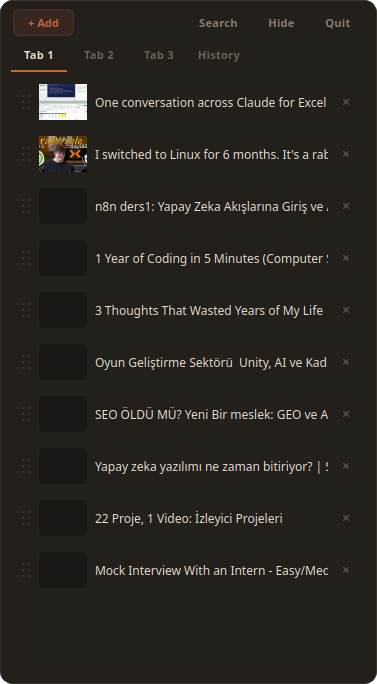
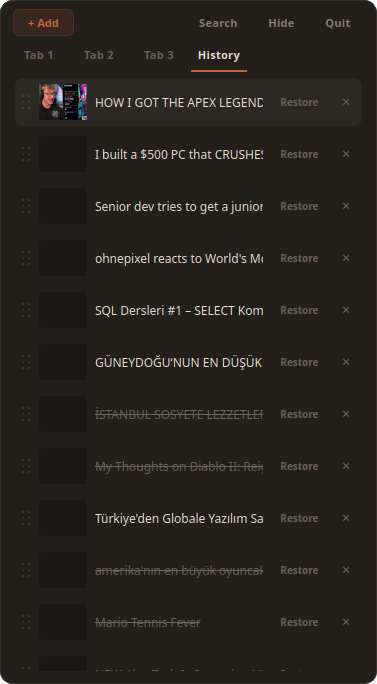
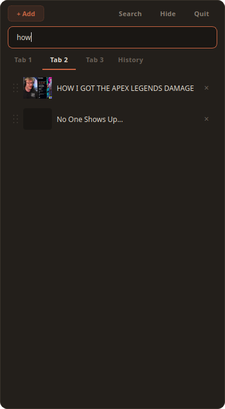

# Lavida

A lightweight, always-on-top Linux desktop widget for managing YouTube video links. Drop links, organize across tabs, and pick up where you left off.

## Features

- **Drag & drop** YouTube URLs onto the window to save them
- **(Toggleable) Always on top** with frameless, resizable window
- **Auto-hide** when another app goes fullscreen
- **Settings panel** for theme, startup, activation key, and shortcut reference

## Usage

```bash
# cd into directory
python main.py
```

On first launch, the app will ask you to set your activation key — just press Enter when ready, then press the mouse button, scroll direction, or keyboard key you want to use to toggle the window. Left and right mouse clicks cannot be used. This is saved and used from then on.

To change the activation key later, open Settings and click the activation key button — it will say "Press any key..." and capture whatever you press next.

### Controls

| Action | Effect |
| --- | --- |
| Drag & drop URL | Add video to current tab |
| Left click | Open in browser, mark as watched |
| Right click | Mark as unwatched |
| Middle click | Delete to history |
| Activation key | Toggle window visibility (global, configurable) |
| Double-click tab | Rename tab |
| Drag and drop a video to the left corner of the monitor | Toggle window visibility shortly |

### Buttons

- **+ Add** - Grab the current browser URL and add it
- **Search** - Filter videos by title
- **⚙** - Open settings panel
- **Hide** - Hide the window (bring back with your activation key)
- **Quit** - Exit the application

## Screenshots







## Contributing

See [CONTRIBUTING.md](CONTRIBUTING.md) for guidelines.

## License

[MIT](LICENSE)
